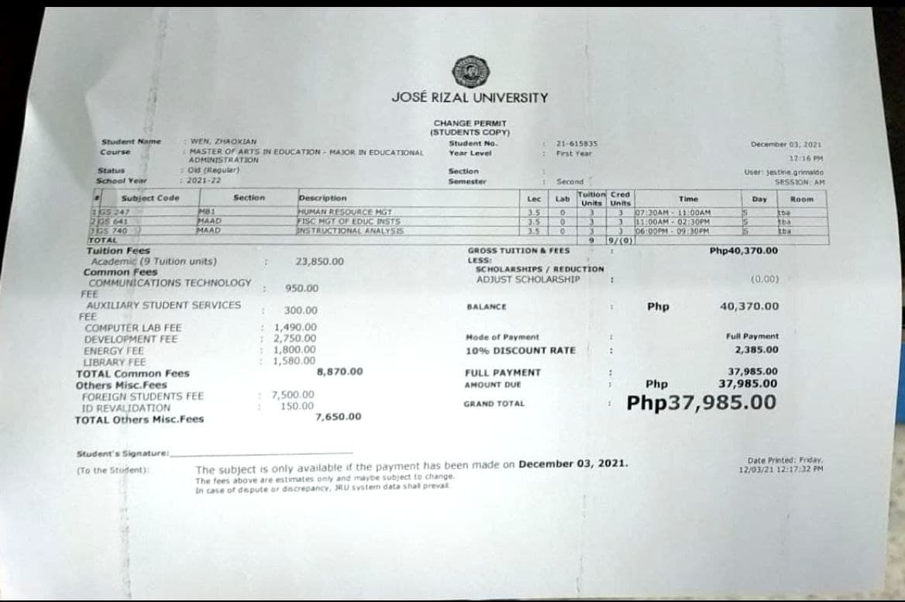

- 👋 Hi, I’m @ID21615835
- 👀 This Courses for my subject of my class for JRU ...
- 🌱 I’m currently learning ...
- 💞️ I’m looking to collaborate on ...
- 📫 How to reach me ...
- all the cousres  

 * 
 * 

```
```
- Change premit for Semster 3  
  * 


# all Courses
* Gs222 Gs232 Gs240 Gs606 Gs641 Gs642 Gs645 Gs247 Gs740 Gs741 Gs752 
* comprehensive examinamtions 
   

### Completed Column ✓
- [] Completed task title  


###  Completed of courses Name ✓
- [✓] Semster 1
  - [[✓] Gs222 , GS232, Gs240, Gs606  

- [✓] Semster 2
  - [✓] Gs645 , GS741, Gs752 

### Not yet Completed Column x


- [✓] Semster 3
  - [ ] Gs247 , GS641, Gs740 

- [x] Semster 4
  - [ ] G642 ，Education and Law 

- [x] comprehensive examinamtions 
  - [ ] Gs259 THSIS WRITING

- [x] Completed task title  
```


https://github.com/ID21615835/todo.md/edit/master/README.md
<!---
ID21615835/ID21615835 is a ✨ special ✨ repository because its `README.md` (this file) appears on your GitHub profile.
You can click the Preview link to take a look at your changes.
--->
